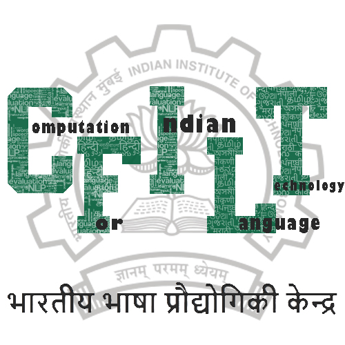

<p align="center"></p>

# IITB-English-Hindi Parallel Corpus 

[](https://github.com/cfiltnlp/IITB-English-Hindi-PC/issues)
[](https://github.com/cfiltnlp/IITB-English-Hindi-PC/network)
[](https://github.com/cfiltnlp/IITB-English-Hindi-PC/stargazers)
[](https://creativecommons.org/licenses/by-nc/4.0/) 
[](https://twitter.com/cfiltnlp)

## About
We provide a notebook that shows how to import the IITB English-Hindi Parallel Corpus from the HuggingFace datasets repository. The notebook also shows how to segment the corpus using BPE tokenization which can be used to train an English-Hindi MT System.

The IIT Bombay English-Hindi corpus contains parallel corpus for English-Hindi as well as monolingual Hindi corpus collected from a variety of existing sources and corpora developed at the Center for Indian Language Technology, IIT Bombay over the years. This page describes the corpus. This corpus has been used at the Workshop on Asian Language Translation Shared Task since 2016 the Hindi-to-English and English-to-Hindi languages pairs and as a pivot language pair for the Hindi-to-Japanese and Japanese-to-Hindi language pairs.

The complete details of this corpus are available at [this URL](https://www.cfilt.iitb.ac.in/iitb_parallel/). We also provide this parallel corpus via browser download from the same URL. We also provide a monolingual Hindi corpus on the same URL.  

### Recent Updates
* Version 3.1 - December 2021 - Added 49,400 sentence pairs to the parallel corpus.
* Version 3.0 - August 2020 - Added ~47,000 sentence pairs to the parallel corpus.

## Usage

You should have the 'datasets' packages installed to be able to use the :rocket: HuggingFace datasets repository. Please use the following command and install via pip:

```code
   pip install datasets
```
In the notebook, we also provide the code to create Byte-pair encoding segmented version of this corpus.
You can choose to tokenize it the way shown in the notebook, or use any other tokenization which also supports the Hindi language.

## Other
You can find a catalogue of other English-Hindi and other Indian language parallel corpora here: [Indic NLP Catalog](https://github.com/indicnlpweb/indicnlp_catalog)

## Maintainer(s)

[Diptesh Kanojia](https://dipteshkanojia.github.io)<br/>
Shivam Mhasker

## Citation

If you use this corpus or its derivate resources for your research, kindly cite it as follows:
Anoop Kunchukuttan, Pratik Mehta, Pushpak Bhattacharyya. The IIT Bombay English-Hindi Parallel Corpus. Language Resources and Evaluation Conference. 2018.

### BiBTeX Citation
```latex
@inproceedings{kunchukuttan-etal-2018-iit,
    title = "The {IIT} {B}ombay {E}nglish-{H}indi Parallel Corpus",
    author = "Kunchukuttan, Anoop  and
      Mehta, Pratik  and
      Bhattacharyya, Pushpak",
    booktitle = "Proceedings of the Eleventh International Conference on Language Resources and Evaluation ({LREC} 2018)",
    month = may,
    year = "2018",
    address = "Miyazaki, Japan",
    publisher = "European Language Resources Association (ELRA)",
    url = "https://aclanthology.org/L18-1548",
}
```
